# Sơ Đồ Thiết Kế Lớp - Hệ Thống Quản Lý Bán Hàng

## UML Class Diagram

```mermaid
classDiagram
    %% Core Data Models
    class Account {
        -int Id
        -string Username
        -string Password
        -UserRole Role
        -string EmployeeName
        -bool IsActive
        +Login()
        +Logout()
        +HasPermission()
    }

    class UserRole {
        <<enumeration>>
        Admin
        Manager
        Cashier
    }

    class Category {
        -int Id
        -string Name
        -DateTime CreatedDate
    }

    class Product {
        -int Id
        -string Name
        -string Code
        -int CategoryId
        -decimal SalePrice
        -decimal PurchasePrice
        -string PurchaseUnit
        -int ImportQuantity
        -int StockQuantity
        -string Description
        -DateTime CreatedDate
        -DateTime UpdatedDate
        +UpdateStock(int quantity)
        +IsAvailable() bool
        +GetPrice() decimal
    }

    class Customer {
        -int Id
        -string Name
        -string Phone
        -string Email
        -string CustomerType
        -string Address
        -int Points
        -string Tier
        -DateTime CreatedDate
        +AddPoints(int points)
        +UpgradeRank()
        +GetHistory()
    }

    class Invoice {
        -int Id
        -int CustomerId
        -int EmployeeId
        -decimal Subtotal
        -decimal TaxPercent
        -decimal TaxAmount
        -decimal Discount
        -decimal Total
        -decimal Paid
        -DateTime CreatedDate
        +AddItem(InvoiceItem item)
        +Calculate()
        +Pay()
    }

    class InvoiceItem {
        -int InvoiceId
        -int ProductId
        -int Quantity
        -decimal UnitPrice
        -decimal LineTotal
        +Calculate()
        +Update()
    }

    class InvoiceStatus {
        <<enumeration>>
        Draft
        Paid
        Cancelled
    }

    %% Manager Classes
    class DatabaseHelper {
        -string ConnectionString
        -int LastInvoiceId
        +InitializeDatabase()
        +ValidateLogin(string username, string password) string
        +GetUserRoleEnum(string username) UserRole
        +RegisterAccount(string username, string employeeName, string password, string role) bool
        +ChangePassword(string username, string oldPassword, string newPassword) bool
        +GetAllAccounts() List~Account~
        +GetEmployeeIdByUsername(string username) int
        +DeleteAccount(string username) bool
        +DeleteAllAccountsExceptAdmin() bool
        +AddCategory(string name) bool
        +GetAllCategories() List~Category~
        +UpdateCategory(int id, string name) bool
        +DeleteCategory(int id) bool
        +DeleteAllCategories() bool
        +AddProduct(string name, string code, int categoryId, decimal salePrice, decimal purchasePrice, string purchaseUnit, int importQuantity, int stockQuantity, string description) bool
        +GetAllProducts() List~Product~
        +UpdateProduct(int id, string name, string code, int categoryId, decimal salePrice, decimal purchasePrice, string purchaseUnit, int importQuantity, int stockQuantity, string description) bool
        +DeleteProduct(int id) bool
        +DeleteAllProducts() bool
        +AddCustomer(string name, string phone, string email, string customerType, string address) int
        +GetAllCustomers() List~Customer~
        +UpdateCustomer(int id, string name, string phone, string email, string customerType, string address) bool
        +DeleteCustomer(int id) bool
        +DeleteAllCustomers() bool
        +SaveInvoice(int customerId, int employeeId, decimal subtotal, decimal taxPercent, decimal taxAmount, decimal discount, decimal total, decimal paid, List~InvoiceItem~ items, DateTime? createdDate, int? invoiceId) bool
        +GetAllInvoices() List~Invoice~
        +QueryInvoices(DateTime? startDate, DateTime? endDate, int? customerId, string searchTerm) List~Invoice~
        +DeleteAllInvoices() bool
        +GetCustomerLoyalty(int customerId) (string tier, int points)
        +UpdateCustomerLoyalty(int customerId, int points, string tier) bool
        +ImportProductsFromCsv(string filePath) int
        +ExportProductsToCsv(string filePath) bool
        +ImportInvoicesFromCsv(string filePath) int
        +ExportInvoicesToCsv(string filePath) bool
        +GetTotalInvoices() int
        +GetTotalRevenue() decimal
        +GetInvoiceDateRange() (DateTime? oldestDate, DateTime? newestDate)
    }

    %% UI Window Classes
    class MainWindow {
        +MainWindow()
        +LoginButton_Click(object sender, RoutedEventArgs e)
        +ChangePasswordButton_Click(object sender, RoutedEventArgs e)
    }

    class DashboardWindow {
        -string _currentUsername
        -string _currentRole
        -bool _isRefreshing
        +static event Action OnDashboardRefreshNeeded
        +DashboardWindow(string username, string role)
        +LoadKpis()
        +ApplyRoleVisibility(UserRole role)
        +TriggerDashboardRefresh()
    }

    class ProductManagementWindow {
        -List~ProductViewModel~ _products
        -List~CategoryViewModel~ _categories
        -ProductViewModel _selectedProduct
        +ProductManagementWindow()
        +LoadProducts()
        +LoadCategories()
        +AddButton_Click(object sender, RoutedEventArgs e)
        +UpdateButton_Click(object sender, RoutedEventArgs e)
        +DeleteButton_Click(object sender, RoutedEventArgs e)
        +DeleteAllButton_Click(object sender, RoutedEventArgs e)
        +ImportCsvButton_Click(object sender, RoutedEventArgs e)
        +ExportCsvButton_Click(object sender, RoutedEventArgs e)
    }

    class CategoryManagementWindow {
        -List~(int Id, string Name)~ _categories
        +CategoryManagementWindow()
        +LoadCategories()
        +SetupPlaceholder()
        +AddButton_Click(object sender, RoutedEventArgs e)
        +UpdateButton_Click(object sender, RoutedEventArgs e)
        +DeleteButton_Click(object sender, RoutedEventArgs e)
        +DeleteAllButton_Click(object sender, RoutedEventArgs e)
    }

    class CustomerManagementWindow {
        -List~CustomerViewModel~ _customers
        -CustomerViewModel _selectedCustomer
        +CustomerManagementWindow()
        +LoadCustomers()
        +AddButton_Click(object sender, RoutedEventArgs e)
        +UpdateButton_Click(object sender, RoutedEventArgs e)
        +DeleteButton_Click(object sender, RoutedEventArgs e)
        +DeleteAllCustomersButton_Click(object sender, RoutedEventArgs e)
    }

    class InvoiceManagementWindow {
        -List~InvoiceItemViewModel~ _invoiceItems
        +InvoiceManagementWindow()
        +LoadCustomers()
        +LoadProducts()
        +ClearInvoice()
        +UpdateTotals()
        +InitializeQRCode()
        +AddProductButton_Click(object sender, RoutedEventArgs e)
        +RemoveItemButton_Click(object sender, RoutedEventArgs e)
        +SaveInvoiceButton_Click(object sender, RoutedEventArgs e)
        +ShowPrintWindow(int invoiceId)
        +UpdateCustomerLoyalty(int customerId)
    }

    class InvoicePrintWindow {
        -List~InvoiceItemViewModel~ _items
        -CustomerListItem _customer
        -InvoiceListItem _invoice
        -int _employeeId
        +InvoicePrintWindow(int invoiceId, int employeeId)
        +PrintButton_Click(object sender, RoutedEventArgs e)
        +GenerateQRCode()
    }

    class TransactionHistoryWindow {
        -List~InvoiceSummaryItem~ _invoices
        +TransactionHistoryWindow()
        +LoadInvoices()
        +InvoicesGrid_SelectionChanged(object sender, SelectionChangedEventArgs e)
    }

    class ReportsWindow {
        -List~InvoiceListItem~ _invoices
        -PaginationHelper~InvoiceListItem~ _paginationHelper
        +ReportsWindow()
        +LoadInvoices()
        +ApplyFilters()
        +ExportToCsvButton_Click(object sender, RoutedEventArgs e)
        +PrintReportButton_Click(object sender, RoutedEventArgs e)
    }

    class ReportsSettingsWindow {
        +ReportsSettingsWindow()
        +LoadDatabaseStatistics()
        +ImportInvoicesCsvButton_Click(object sender, RoutedEventArgs e)
        +ExportInvoicesCsvButton_Click(object sender, RoutedEventArgs e)
        +DeleteAllInvoicesButton_Click(object sender, RoutedEventArgs e)
    }

    class UserManagementWindow {
        -List~UserManagementItem~ _allUsers
        -List~UserManagementItem~ _filteredUsers
        +UserManagementWindow()
        +LoadUsers()
        +AddUserButton_Click(object sender, RoutedEventArgs e)
        +EditUserButton_Click(object sender, RoutedEventArgs e)
        +DeleteUserButton_Click(object sender, RoutedEventArgs e)
        +DeleteAllUsersButton_Click(object sender, RoutedEventArgs e)
    }

    class AddEditUserWindow {
        -UserManagementItem _user
        -bool _isEditMode
        +AddEditUserWindow(UserManagementItem user, bool isEditMode)
        +SaveButton_Click(object sender, RoutedEventArgs e)
        +CancelButton_Click(object sender, RoutedEventArgs e)
    }

    class SettingsWindow {
        +SettingsWindow()
        +TestConnectionButton_Click(object sender, RoutedEventArgs e)
        +SaveSettingsButton_Click(object sender, RoutedEventArgs e)
        +SavePaymentSettingsButton_Click(object sender, RoutedEventArgs e)
    }

    class TierSettingsWindow {
        +TierSettingsWindow()
        +LoadCurrentSettings()
        +SaveButton_Click(object sender, RoutedEventArgs e)
        +ResetToDefaultButton_Click(object sender, RoutedEventArgs e)
    }

    class ChangePasswordWindow {
        +ChangePasswordWindow()
        +ChangePassword_Click(object sender, RoutedEventArgs e)
        +Cancel_Click(object sender, RoutedEventArgs e)
    }

    %% Relationships
    Account "1" -- "1" UserRole : has
    Category "1" -- "*" Product : contains
    Product "1" -- "*" InvoiceItem : referenced by
    Customer "1" -- "*" Invoice : creates
    Invoice "1" -- "*" InvoiceItem : contains
    Invoice "1" -- "1" InvoiceStatus : has
    
    DatabaseHelper ..> Account : manages
    DatabaseHelper ..> Category : manages
    DatabaseHelper ..> Product : manages
    DatabaseHelper ..> Customer : manages
    DatabaseHelper ..> Invoice : manages
    DatabaseHelper ..> InvoiceItem : manages
    
    MainWindow ..> DatabaseHelper : uses
    MainWindow ..> DashboardWindow : creates
    
    DashboardWindow ..> ProductManagementWindow : creates
    DashboardWindow ..> CategoryManagementWindow : creates
    DashboardWindow ..> CustomerManagementWindow : creates
    DashboardWindow ..> InvoiceManagementWindow : creates
    DashboardWindow ..> TransactionHistoryWindow : creates
    DashboardWindow ..> ReportsWindow : creates
    DashboardWindow ..> ReportsSettingsWindow : creates
    DashboardWindow ..> UserManagementWindow : creates
    DashboardWindow ..> SettingsWindow : creates
    DashboardWindow ..> TierSettingsWindow : creates
    DashboardWindow ..> ChangePasswordWindow : creates
    
    ProductManagementWindow ..> DatabaseHelper : uses
    CategoryManagementWindow ..> DatabaseHelper : uses
    CustomerManagementWindow ..> DatabaseHelper : uses
    InvoiceManagementWindow ..> DatabaseHelper : uses
    InvoicePrintWindow ..> DatabaseHelper : uses
    TransactionHistoryWindow ..> DatabaseHelper : uses
    ReportsWindow ..> DatabaseHelper : uses
    ReportsSettingsWindow ..> DatabaseHelper : uses
    UserManagementWindow ..> DatabaseHelper : uses
    AddEditUserWindow ..> DatabaseHelper : uses
    SettingsWindow ..> DatabaseHelper : uses
    TierSettingsWindow ..> DatabaseHelper : uses
    ChangePasswordWindow ..> DatabaseHelper : uses
    
    UserManagementWindow ..> AddEditUserWindow : creates
    InvoiceManagementWindow ..> InvoicePrintWindow : creates
```

## Mô Tả Kiến Trúc

### 1. **Lớp Dữ Liệu (Data Models)**
- **Account**: Quản lý thông tin tài khoản người dùng
- **UserRole**: Enum định nghĩa các vai trò (Admin, Manager, Cashier)
- **Category**: Danh mục sản phẩm
- **Product**: Thông tin sản phẩm
- **Customer**: Thông tin khách hàng
- **Invoice**: Hóa đơn bán hàng
- **InvoiceItem**: Chi tiết từng sản phẩm trong hóa đơn
- **InvoiceStatus**: Enum trạng thái hóa đơn (Draft, Paid, Cancelled)

### 2. **Lớp Quản Lý (Manager)**
- **DatabaseHelper**: Quản lý tất cả thao tác database

### 3. **Lớp Giao Diện (UI Windows)**
- **MainWindow**: Màn hình đăng nhập
- **DashboardWindow**: Màn hình chính điều hướng
- **ProductManagementWindow**: Quản lý sản phẩm
- **CategoryManagementWindow**: Quản lý danh mục
- **CustomerManagementWindow**: Quản lý khách hàng
- **InvoiceManagementWindow**: Tạo hóa đơn
- **InvoicePrintWindow**: In hóa đơn
- **TransactionHistoryWindow**: Lịch sử giao dịch
- **ReportsWindow**: Báo cáo
- **ReportsSettingsWindow**: Cài đặt báo cáo
- **UserManagementWindow**: Quản lý người dùng
- **SettingsWindow**: Cài đặt hệ thống
- **TierSettingsWindow**: Cài đặt hạng thành viên
- **ChangePasswordWindow**: Đổi mật khẩu

## Đặc Điểm Kiến Trúc

1. **Mô hình MVC**: Tách biệt rõ ràng giữa Model (DatabaseHelper), View (Windows), và Controller (Event Handlers)

2. **Singleton Pattern**: DatabaseHelper sử dụng static methods để đảm bảo một instance duy nhất

3. **Repository Pattern**: DatabaseHelper đóng vai trò repository cho tất cả thao tác dữ liệu

4. **Event-Driven Updates**: DashboardWindow sử dụng events để cập nhật real-time

5. **Role-Based Access Control**: UserRole quản lý phân quyền
